# Architecture Diagrams — C4 Model (Mermaid)

**Version**: 1.0
**Generated**: 2026-03-21 (INFRA session 40)

---

## Level 1: System Context

Who uses Time, and what external systems does it touch?

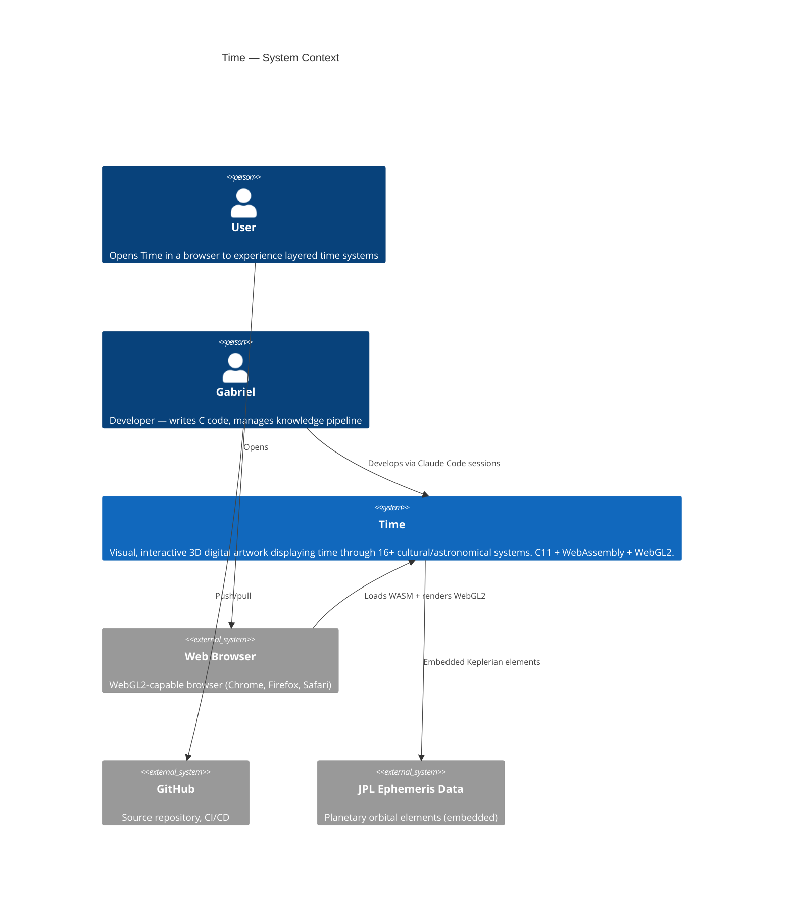

---

## Level 2: Container Diagram

What are the major runtime containers inside Time?

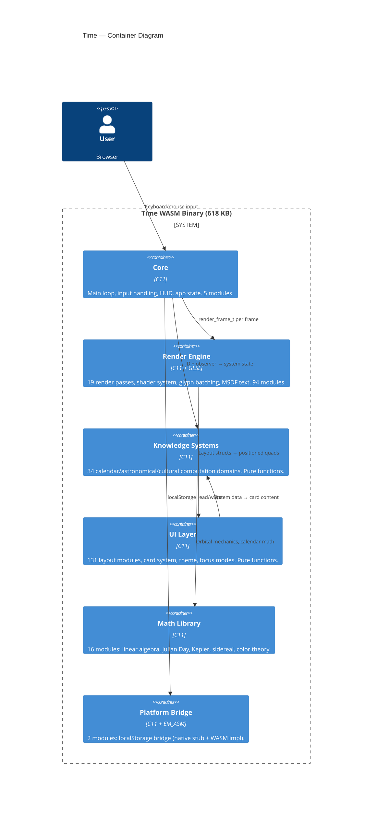

---

## Level 3: Component — Render Engine

The render engine is the largest container. How do its passes compose?

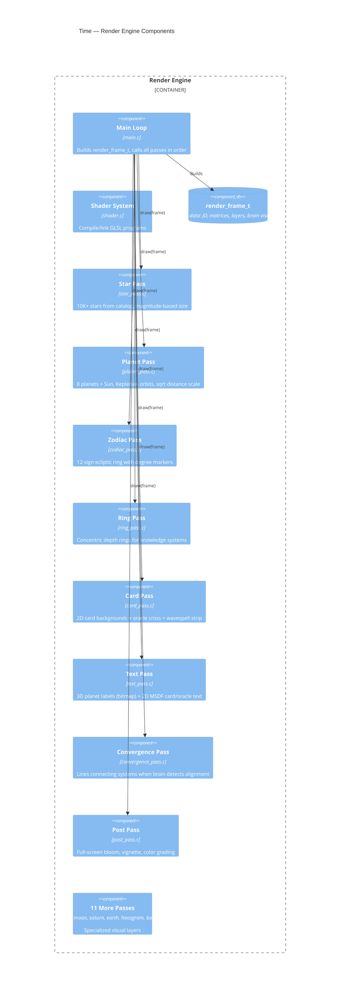

---

## Level 3: Component — Knowledge Systems

34 cultural/astronomical computation domains, all pure functions.

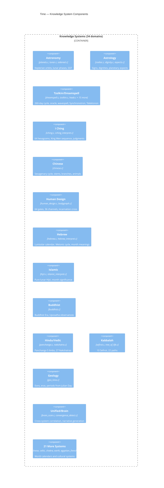

---

## Level 3: Component — UI Layer

Layout computation, card pipeline, theming.

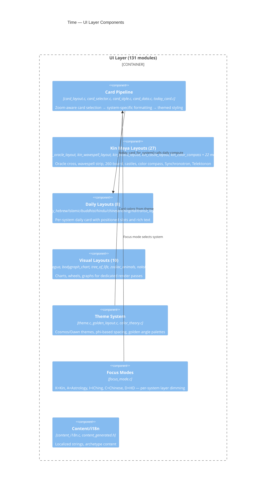

---

## Data Flow: One Frame

How data flows from simulation time to pixels on screen.

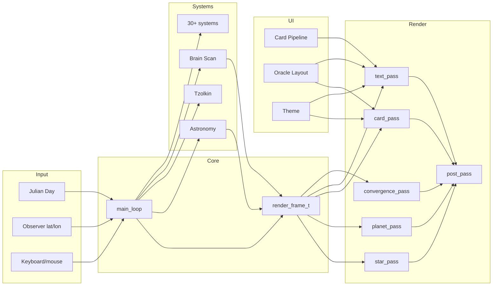

---

## Build Pipeline

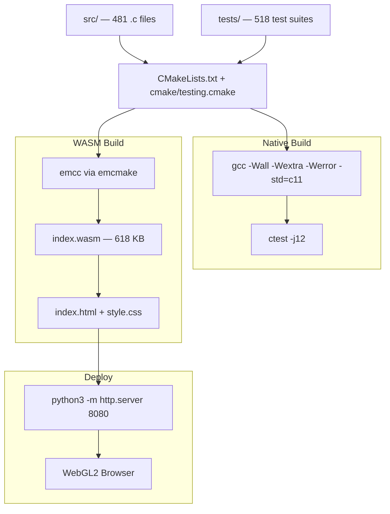

---

## Stream Coordination Flow

9 streams + MEGA + NERVE — who talks to whom, inbox/outbox routing.

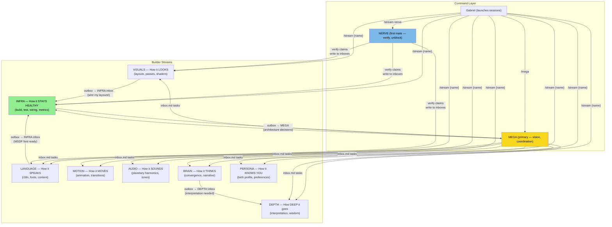

### File-Based Communication Protocol

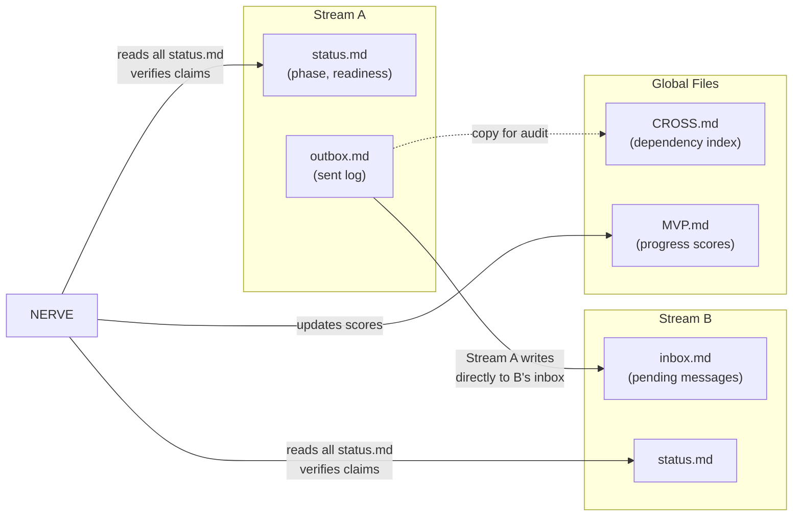

---

## Knowledge Pipeline

Book acquisition → extraction → routing → code → display.

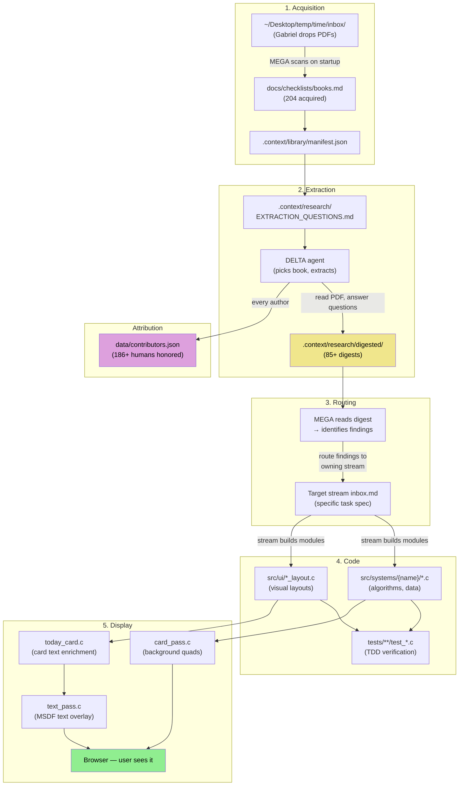

---

## Art Asset Pipeline

Reference material → generation → optimization → display.

```mermaid
flowchart LR
    subgraph Reference["1. Reference"]
        BOOKS["Library books\n(Itten, Albers, Tufte)"]
        RESEARCH["Stream research docs\n(visual surveys)"]
    end

    subgraph Generation["2. Generation"]
        PROMPT["DALL-E / Midjourney\nprompt crafting"]
        GABRIEL_GEN["Gabriel generates\nimages externally"]
        RAW["Raw PNG/SVG assets"]
    end

    subgraph Optimization["3. Optimization (ART stream)"]
        COMPRESS["Compress / resize\n(WebGL texture limits)"]
        ATLAS["Atlas packing\n(MSDF, sprite sheets)"]
        C_HEADER["gen_msdf_header.py\n→ C header with pixel data"]
    end

    subgraph Integration["4. Integration (INFRA)"]
        DATA_H["src/render/*_data.h\n(embedded atlas)"]
        PASS_C["Render pass .c\n(GL texture upload)"]
        WASM["WASM binary\n(asset embedded)"]
    end

    BOOKS --> PROMPT
    RESEARCH --> PROMPT
    PROMPT --> GABRIEL_GEN --> RAW
    RAW --> COMPRESS --> ATLAS --> C_HEADER
    C_HEADER --> DATA_H --> PASS_C --> WASM

    style GABRIEL_GEN fill:#f9d71c,color:#000
    style WASM fill:#90ee90,color:#000
```

---

## Experience Verification Pipeline

How we verify that code changes produce visible, correct output.

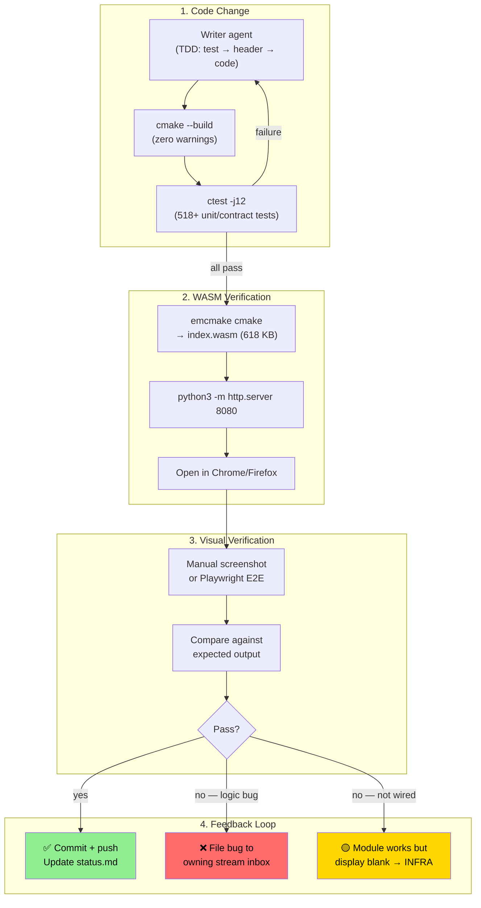

---

*Diagrams follow the [C4 model](https://c4model.com/) and process flow conventions using [Mermaid](https://mermaid.js.org/) syntax. Render in any Mermaid-compatible viewer (GitHub, VS Code, etc.).*
